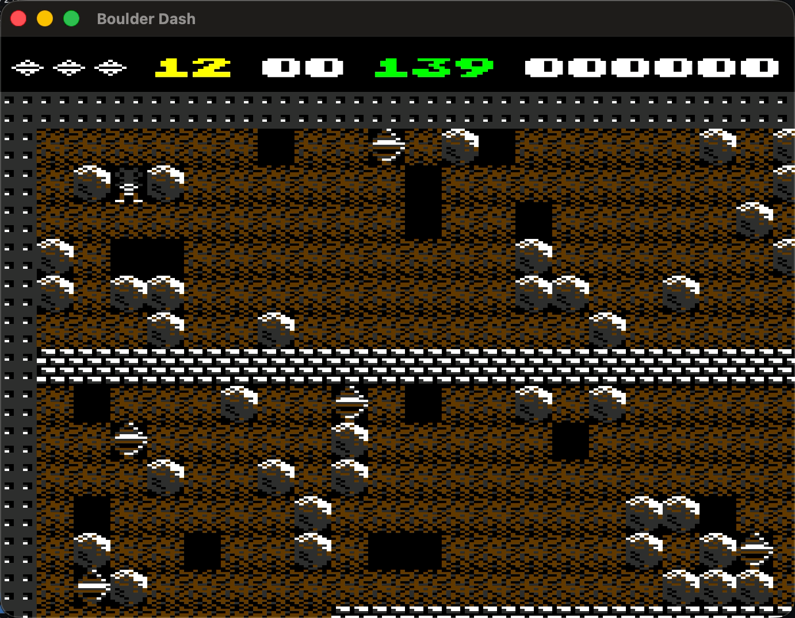

# Boulder Dash 1984 Remake

A Boulder Dash game remade in Python using pyglet.



## Features

- 20 Tile-based levels
- Falling physics for boulders and diamonds
- Enemies: fireflies and butterflies
- Amoeba growth logic
- Magic wall

## Requirements

- Python 3.14.2

Dependencies in `requirements.txt`

## Installation

1) Create and activate a virtual environment

```
python3 -m venv .venv
source .venv/bin/activate
```
2) Install dependencies

```
pip3 install -r requirements.txt
```

## Run

```
python3 main.py
```
## Controls

- Move: Arrow keys/WASD
- Restart: hold R
    - During gameplay: restarts level
    - On game over: restart a new run

## Configuration:

game/cfg/config.yaml:

- Window dimensions
- Render scale
- FPS counter

## Tests

Run from root:

```
pytest
```
